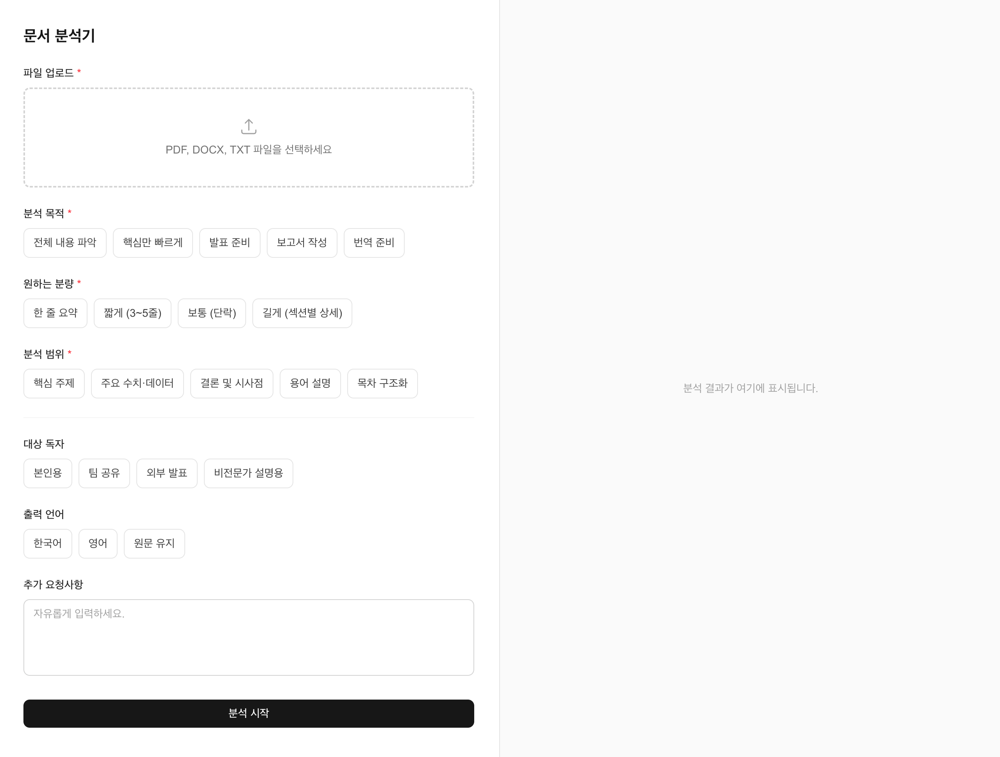
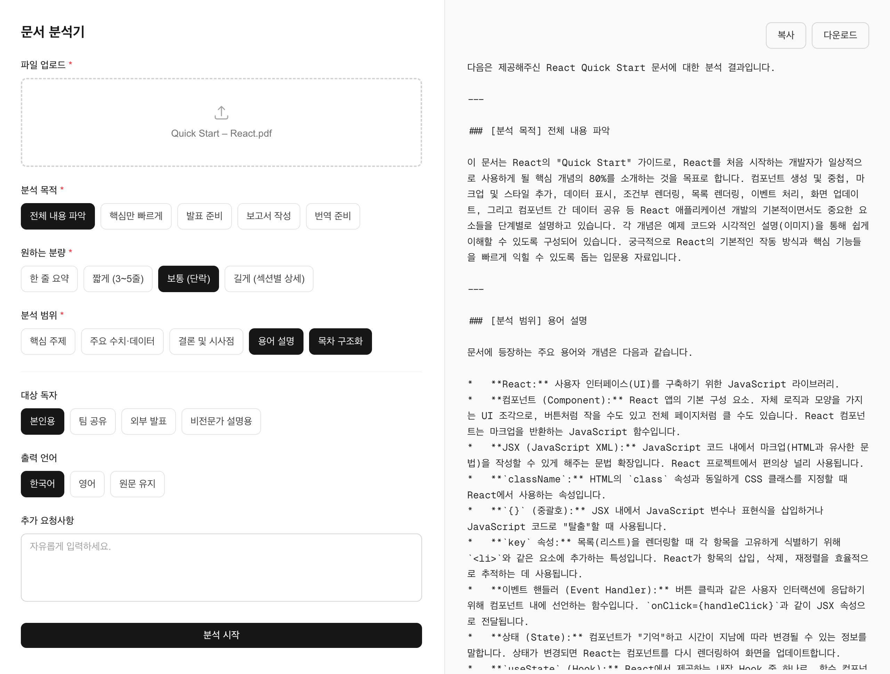

# Doc Analyzer

PDF, DOCX, TXT 파일을 업로드하면 Gemini AI가 맞춤 요약·분석 결과를 제공하는 웹앱입니다.

## 스크린샷

| 폼 화면                                         | 결과 화면                                           |
| ----------------------------------------------- | --------------------------------------------------- |
|  |  |

## 프로젝트 배경

실무에서 AI 연동 문서 작성 보조 도구를 개발하면서, AI가 유용한 결과를 내려면 사용자의 의도와 맥락을 정확히 전달하는 것이 핵심이라는 걸 경험했습니다.

그러면서 평소에 느끼던 불편함이 떠올랐습니다. 긴 문서를 읽을 때 목적에 따라 필요한 정보가 다른데, 기존 AI 요약 도구들은 결과를 사용자가 제어하기 어렵다는 점이었습니다.

이 두 경험을 바탕으로, 분석 목적·원하는 분량·범위·대상 독자 등을 직접 지정하면 그에 맞는 결과를 돌려주는 문서 분석 도구를 직접 설계하고 구현했습니다.

## 기술 스택

| 분류       | 사용 기술                       |
| ---------- | ------------------------------- |
| 프레임워크 | Next.js 16 (App Router)         |
| 언어       | TypeScript                      |
| 스타일     | Tailwind CSS v4                 |
| 폼         | react-hook-form                 |
| AI         | Gemini API (`gemini-2.5-flash`) |
| 파일 파싱  | pdf-parse, mammoth              |

## 주요 기능

- **파일 업로드** — PDF, DOCX, TXT 지원
- **결과 내보내기** — 분석 결과 복사 및 마크다운 파일 다운로드
- **분석 옵션** — 아래 항목을 조합해 맞춤 분석 결과를 생성합니다

| 항목          | 선택지                                                                              | 필수 여부 |
| ------------- | ----------------------------------------------------------------------------------- | --------- |
| 분석 목적     | 전체 내용 파악 / 핵심만 빠르게 / 발표 준비 / 보고서 작성 / 번역 준비                | 필수      |
| 원하는 분량   | 한 줄 요약 / 짧게 (3~5줄) / 보통 (단락) / 길게 (섹션별 상세)                        | 필수      |
| 분석 범위     | 핵심 주제 / 주요 수치·데이터 / 결론 및 시사점 / 용어 설명 / 목차 구조화 (다중 선택) | 필수      |
| 대상 독자     | 본인용 / 팀 공유 / 외부 발표 / 비전문가 설명용                                      | 선택      |
| 출력 언어     | 한국어 / 영어 / 원문 유지                                                           | 선택      |
| 추가 요청사항 | 자유 텍스트 입력                                                                    | 선택      |

## 기술적 의사결정

### 사용자 입력값 기반 동적 프롬프트 생성

이 프로젝트의 핵심은 사용자가 선택한 분석 목적·분량·범위·대상 독자·출력 언어를 조합해 매 요청마다 다른 프롬프트를 생성하는 구조입니다.

고정된 프롬프트를 쓰면 구현은 단순하지만, 동일한 문서도 읽는 목적에 따라 필요한 정보가 달라진다는 이 앱의 전제와 맞지 않습니다. 반대로 사용자가 프롬프트를 직접 작성하게 하면 자유도는 높지만, 비전문 사용자에게는 진입 장벽이 된다고 생각했습니다.

사용자는 선택만 하면 되고, AI에게는 맥락이 충분히 전달되도록 만드는 것이 목표였습니다.

### gemini-2.5-flash 선택 이유

문서 분석은 입력 토큰이 많아지는 작업입니다. `gemini-2.5-pro`처럼 추론 능력이 높은 모델보다, 긴 컨텍스트를 빠르게 처리하는 데 최적화된 `gemini-2.5-flash`가 이 용도에 더 적합하다고 판단했습니다. 요약·분석은 복잡한 추론보다 빠른 응답과 비용 효율이 중요하기 때문입니다.

## 프로젝트 구조

```
src/
├── app/
│   ├── api/analyze/      # 파일 파싱 + Gemini API 호출
│   ├── layout.tsx
│   └── page.tsx          # 레이아웃 (폼 + 결과)
├── components/
│   ├── ui/               # 재사용 가능한 기본 UI 컴포넌트
│   ├── AnalysisForm.tsx  # 분석 옵션 입력 폼
│   └── ResultPanel.tsx   # 분석 결과 표시
└── lib/
    ├── gemini.ts         # 프롬프트 빌더 + Gemini API 연동
    ├── options.ts        # 폼 옵션 상수
    └── parsers.ts        # PDF/DOCX/TXT 파일 파싱
```

## 시작하기

### 1. 패키지 설치

```bash
# npm
npm install

# yarn
yarn install
```

### 2. 환경변수 설정

`.env.local` 파일을 생성하고 Gemini API 키를 입력합니다.

```bash
GEMINI_API_KEY=your_api_key_here
```

API 키는 [Google AI Studio](https://aistudio.google.com)에서 발급받을 수 있습니다.

### 3. 개발 서버 실행

```bash
# npm
npm run dev

# yarn
yarn dev
```

브라우저에서 [http://localhost:3000](http://localhost:3000)을 열어 확인합니다.

## 향후 계획

- [ ] Streaming 응답 적용 (결과가 실시간으로 타이핑되듯 출력)
- [ ] 분석 히스토리 저장 기능 (최근 분석 결과 목록 조회)
- [ ] 여러 파일 동시 업로드 및 비교 분석
- [ ] 분석 결과 공유 링크 생성
- [ ] 파일 형식 확장 (Excel, PPT 지원)
